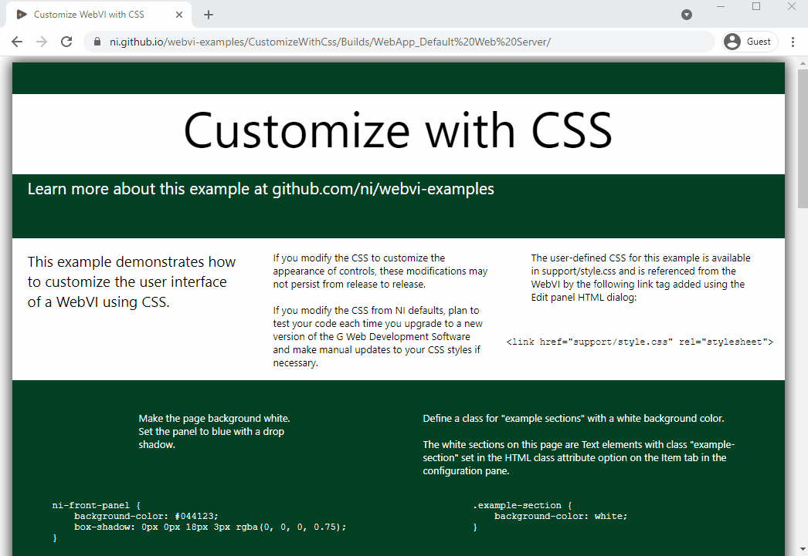

# Customize WebVI with CSS

[](https://ni.github.io/webvi-examples/CustomizeWithCss/Builds/WebApp_Web%20Server/)
[]()

This example demonstrates how to customize the styling of a WebVI using CSS.

The underlying technology used by WebVIs is HTML Custom Elements. One of the advantages of using HTML Custom Elements is the ability leverage CSS in a web application that separates style from the content. For example, you could create a custom CSS file that is shared across your organization for custom styles and layouts.



## Usage

You can use this approach in your own projects if you are familiar with CSS and how it interacts with HTML. For example, you can customize controls and indicators to match a corporate color scheme or make them accessible for color-blind users or in low contrast situations.

## Dependencies

- G Web Development Software

## Setup

1. Clone the [ni/webvi-examples](https://github.com/ni/webvi-examples) repository to your machine.
2. Open `CustomizeWithCss/CustomizeWithCss.gwebproject`.
3. On the **Project Files** tab, expand `WebApp.gcomp` and open `index.gviweb`.
4. Click the **Run** button.
5. Build the web application.  
  a. On the **Project Files** tab, double-click `WebApp.gcomp` to open the web application component.  
  b. On the **Document** tab, click **Build**.  

**Note:** To view the build output on your machine, click **Locate Directory in Windows Explorer** on the **Document** tab once your application finishes building. You can automatically launch and view the Web application locally by going to **System Designer** >> **Web Server** >> right-click `WebApp.gcomp` >> **Run**

## Hosting

You can manually move the build output found at `\CustomizeWithCss\Builds` to any web server. This project also includes a Distribution (`WebApp.lvdist`) that can be used to build a package (.nipkg). Packages utilize NI Package Manager to automated the process of installing, upgrading, or removing the web app. A package is also a requirement for hosting a Web application on SystemLink Cloud.

### SystemLink Cloud Web App Hosting

The following steps can be used to host the web app on SystemLink Cloud

1. Open `CustomizeWithCss.gwebproject`.
2. Open `WebApp.lvdist`.
3. Click the build icon in the top command bar of this distribution document
4. Open a Web browser and navigate to https://www.systemlinkcloud.com/webapphosting
5. Click the **Choose nipkg** button and select the nipkg built in step 3.
6. When the upload is complete, click on your newly uploaded Web app from your list of Web apps

### Local Hosting

The following steps can be used to host the web app on a local web server

#### Hosting on the NI Web Server with a nipkg

1. Open `CustomizeWithCss.gwebproject`
2. Open `WebApp.lvdist`.
3. Click the build icon in the top command bar of this distribution document
4. Double-click the nipkg and follow the on screen instructions
5. Open a web browser and navigate to `http://localhost:9090/customizewithcss/`

#### Hosting on the LabVIEW 2009-2017 Web Server

1. Open `C:\Program Files (x86)\National Instruments\Shared\NI WebServer\www`.
2. Copy the `WebApp_Web Server` directory into the `www` directory.
3. Open a web browser and navigate to `http://localhost:8080/WebApp_Web%20Server/`

#### Hosting on the NI Web Server

1. Open `C:\Program Files\National Instruments\Shared\Web Server\htdocs`.
2. Copy the `WebApp_Web Server` directory into the `htdocs` directory.
3. Open a web browser and navigate to `http://localhost:9090/WebApp_Web%20Server/`.

## Details

### Adding custom CSS rules to a WebVI

1. Add a CSS file to the root of the Web Application component, for example: `custom_style.css`
2. Open `index.gviweb` and launch the HTML source dialog by pressing the `Edit panel HTML` button in the WebVI panel's toolbar.
3. Enter the following line inside the `head` section of the page right before the closing `</head>` tag.

    ```html
    <link rel="stylesheet" href="custom_style.css">
    ```

4. Click the **OK** button in the HTML source dialog and build the web application. Refer to the [setup section](#setup) for instructions on building a web application.
5. Modify `custom_style.css` to include the style rules for the page

### CSS rule behavior

The following section describes the behavior of the CSS rules used in the example. The style rules are included from the `WebApp.gcomp/support/style.css` file.

<!-- Note: The following should be copied directly from support/style.css file -->
```css
/*
Make the page background white.
Set the panel to blue with a drop shadow.
*/

ni-front-panel {
    background-color: #00adef;
    box-shadow: 0px 0px 18px 3px rgba(0, 0, 0, 0.75);
}

/*
Define a class for "example sections" with a white background color.
*/

.example-section {
    background-color: white;
}

/*********************************/

/*
Set the thumb to yellow when true, including its hover (mouseover) state.
*/

jqx-switch-button[checked] .jqx-thumb::after,
jqx-switch-button[checked]:hover .jqx-thumb::after {
    background: yellow;
}

/*********************************/

/*
Set the track to be transparent.
Set the track fill to yellow.
Set the track labels to be white.
*/

jqx-slider .jqx-container .jqx-track::before {
    background: transparent;
    border: none;
}

jqx-slider {
    --ni-fill-background: yellow;
    --ni-foreground-color: white !important;
}


/*********************************/

/*
Set the power button to have an orange foreground when true.
*/

.activation-button {
    --ni-true-foreground-color: orange;
}

/*
Set the power button to have a yellow background.
Set the circular progress bar to have a yellow fill.
*/

.activation-button.warning {
    --ni-true-background: yellow;
}

.activation-progress.warning {
    --ni-fill-background: yellow;
}

/*
Set the power button to have a red background.
Set the circular progress bar to have a red fill.
*/

.activation-button.danger {
    --ni-true-background: red;
}

.activation-progress.danger {
    --ni-fill-background: red;
}


/*********************************/

/*
Make the non-plot area and the plot area transparent.
Make the axis ticks white.
Make the axis labels light gray.
*/

ni-cartesian-graph {
    background: transparent;
    border: none;
}

ni-cartesian-graph .flot-x-axis text,
ni-cartesian-graph .flot-y-axis text {
    fill: white;
}

ni-cartesian-graph text.axisLabels {
    fill: lightgray;
}


/*********************************/

/*
Set the tank scale color to hotpink.
*/

jqx-tank {
    --ni-foreground-color: hotpink !important;
}

/*********************************/

/*
Make the numeric text white.
Remove all borders and background colors.
*/

jqx-numeric-text-box {
    --ni-border: none;
    --ni-foreground-color: white !important;
    --ni-indicator-background-color: transparent;
    --ni-control-background-color: transparent;
}
```
